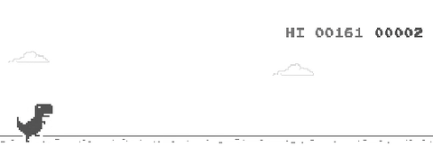

# DQN Agent to play Chrome Dino Game

- A Deep Convolutional Network built with **Tensorflow** is used to get environment state from raw image data from Chrome Browser, processed using **OpenCV**. 
- An **OpenAI** gym environment had been modified to be able to connect with browser game and training notebook. From the predicted state variables, the agent explores the environment with epsilon-greedy policy. 
- To increase sample efficiency and independently distribute the states for training, Experience Replay had also been used.

### Demo

### Installation
- Start by cloning the repository.

`$ git clone https://github.com/ShivenTripathi/Hack2Learn.git`

- Install gym-env by following instructions in Hack2Learn/gym-chrome-dino/

### Usage
- Use Hack2Learn/DQN Agent to play Chrome Dino.ipynb to train, test your model. 
- You can save and load the model to view result from the the last cells.

### Requirements
- Use the requirements.txt file

`conda install --file requirements.txt`

### Acknowledgements
- [elvisyjlin](https://github.com/elvisyjlin/gym-chrome-dino.git)
- [PracticalRL](https://github.com/shenweichen/Coursera/tree/master/Specialization_Advanced_Machine_Learning_Higher_School_of_Economics/Course4_Practical%20Reinforcement%20Learning)

## Hack-2-Learn

Hack-2-Learn will hold short and interesting projects that can be completed in 1-2 weeks.

 

 